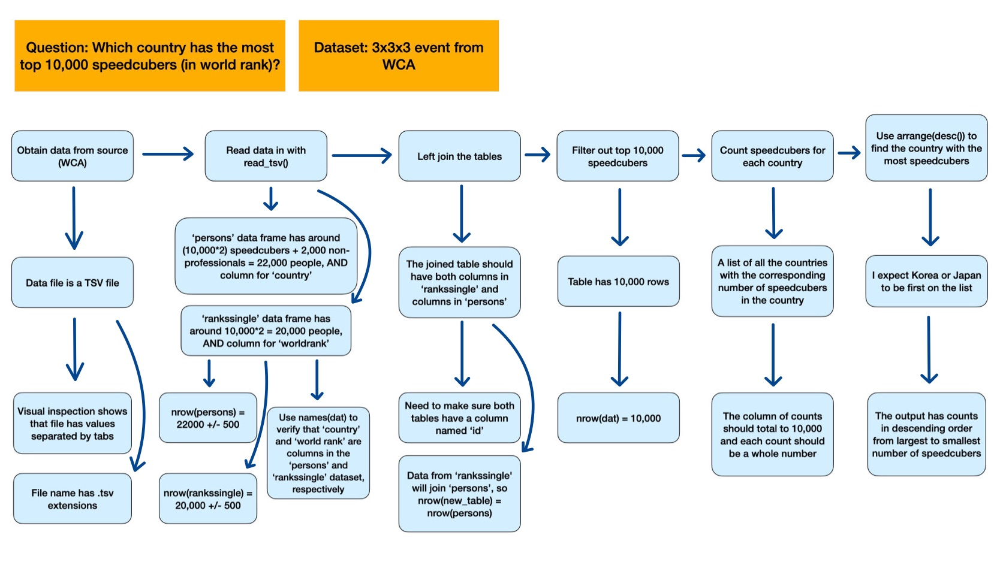

### Enter the names and EIDs of the group members here: Phoebe Wang

## Additional Question 1

Which country has the most top 10,000 speedcubers (in world rank)?

### Expectation for Question 1

I expect Korea or Japan to have the most speedcubers who are in the top 10,000 speedcubers worldwide for best single time.

## Additional Question 2

What are the top 5 competitions with the highest number of participants?

### Expectation for Question 2

I expect the top 5 competitions with the highest number of participants to be from the UK Opens, Stevenage competitions that occur during summer (June, July, August), and the Shri Ram Cubing Challenges.

## Analysis Plan

Describe your analysis plan or include an image/diagram depicting it. If you are including an image, put the name of the image file in the parentheses below:

