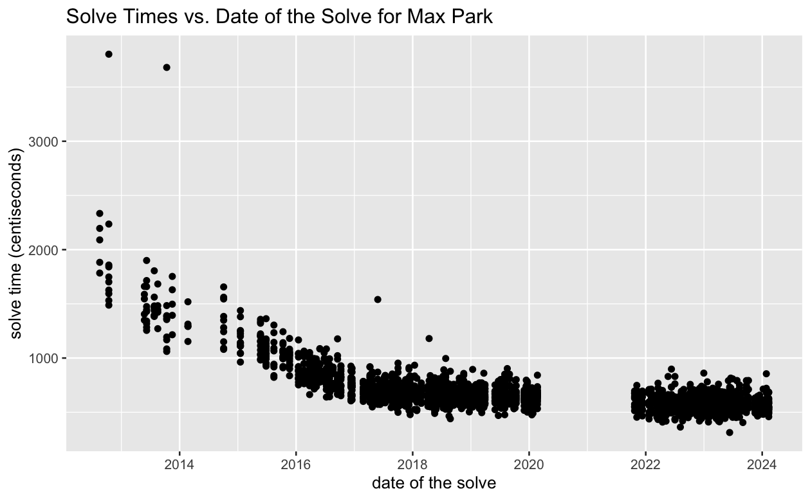

# Elements of Data Science

Programming language: R

## [Project 1: WCA 3x3x3 speedcubing event](Project_1_Report.pdf)

Join, tidy, and manipulate multiple datasets to draw conclusions on the WCA 3x3x3 speedcubing event. 

### Answers 5 required questions + 2 additional questions:

#### Active Speedcubers
1. How many active (3x3x3) speedcubers are there registered with the WCA?

#### World Records
1. Who holds the current world record single? On what date was this record set?
2. Who previously held the world record single? On what date was this previous record set?

#### Regional Rankings
1. Who is the top ranked male speedcuber (for single best time) in Australia?
2. Who is the top ranked female speedcuber (for single best time) in Europe?

#### Time Until Sub-5
1. For the current top 10 speedcubers in the world (as recorded in the RanksSingle table), on average,
how many solves did they have to do before achieving a sub-5 second solve?
2. For one of the top 10 speedcubers make a plot of their solve times vs. the date of the solve

#### Up-and-Coming Speed Cubers
Come up with a list of five speedcubers (provide their names and WCA IDs) that you have identified as “up-and-coming”.

#### Additional questions:
1. Which country has the most top 10,000 speedcubers?
2. What are the top 5 competitions with the highest number of participants?
